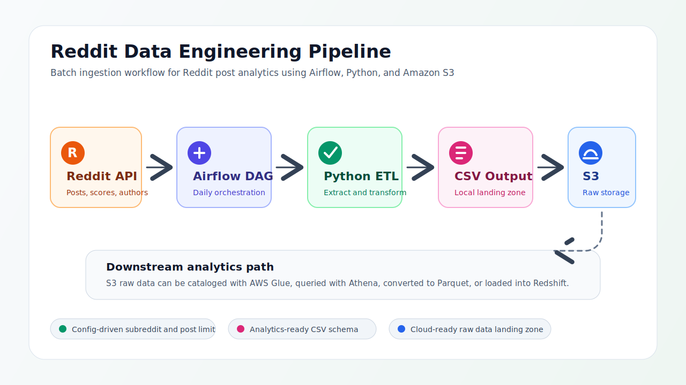

# Reddit Data Engineering Pipeline

A production-oriented data pipeline for collecting Reddit post data, transforming it into an analytics-ready CSV dataset, and storing the output in Amazon S3. The project uses Apache Airflow for orchestration, Python for extraction and transformation, and Docker Compose for local development.

## Overview

This pipeline is designed to support repeatable Reddit data ingestion for analytics and downstream data warehouse workflows. It extracts posts from a configurable subreddit, standardizes the selected fields, writes the result to local storage, and uploads the generated file to an S3 bucket.

## Architecture



The pipeline follows a simple batch processing flow:

1. Airflow schedules and runs the workflow.
2. The Reddit API provides post data for the configured subreddit.
3. Python transforms the raw API response into a structured dataset.
4. The transformed CSV file is written to the local Airflow data volume.
5. The output file is uploaded to Amazon S3 under the `raw/` prefix.

## Features

- Configurable subreddit, time filter, post limit, and Reddit user agent.
- Daily Airflow DAG for automated batch ingestion.
- Structured Reddit post extraction with fields such as score, comments, author, URL, upvote ratio, and permalink.
- Pandas-based transformation for clean CSV output.
- S3 upload step with automatic bucket creation when needed.
- Docker Compose environment with Airflow, PostgreSQL, Redis, scheduler, webserver, and worker services.

## Project Structure

```text
.
|-- assets/
|   `-- reddit_pipeline_architecture.svg
|-- config/
|   `-- config.conf.example
|-- dags/
|   `-- reddit_dag.py
|-- data/
|   `-- output/
|-- etls/
|   |-- aws_etl.py
|   `-- reddit_etl.py
|-- pipelines/
|   |-- aws_s3_pipeline.py
|   `-- reddit_pipeline.py
|-- utils/
|   `-- constants.py
|-- airflow.env
|-- docker-compose.yml
|-- Dockerfile
|-- README.md
`-- requirements.txt
```

## Prerequisites

- Docker and Docker Compose
- Python 3.9 or later
- Reddit API credentials
- AWS credentials with permission to create and write to an S3 bucket

## Configuration

Create a local configuration file from the provided template:

```bash
cp config/config.conf.example config/config.conf
```

Update the following sections in `config/config.conf`:

```ini
[reddit]
subreddit = dataengineering
time_filter = day
post_limit = 100
user_agent = PersonalRedditAnalytics/1.0

[api_keys]
reddit_secret_key = <your-reddit-secret-key>
reddit_client_id = <your-reddit-client-id>

[aws]
aws_access_key_id = <your-aws-access-key-id>
aws_secret_access_key = <your-aws-secret-access-key>
aws_region = <your-aws-region>
aws_bucket_name = <your-s3-bucket-name>
```

The local `config.conf` file is ignored by Git to prevent secrets from being committed.

## Running Locally

Initialize Airflow metadata and create the default admin user:

```bash
docker-compose up airflow-init
```

Start the full pipeline environment:

```bash
docker-compose up -d
```

Open the Airflow web UI:

```text
http://localhost:8080
```

Default local credentials:

```text
username: admin
password: admin
```

Enable and run the DAG:

```text
personal_reddit_analytics_pipeline
```

## Output

The extraction task writes a CSV file to:

```text
data/output/reddit_<YYYYMMDD>.csv
```

The upload task stores the same file in S3:

```text
s3://<bucket-name>/raw/reddit_<YYYYMMDD>.csv
```

## Data Fields

The pipeline extracts and stores the following Reddit post fields:

- `id`
- `title`
- `score`
- `num_comments`
- `author`
- `created_utc`
- `url`
- `upvote_ratio`
- `subreddit`
- `permalink`
- `over_18`
- `edited`
- `spoiler`
- `stickied`

## Roadmap

- Add automated validation for the generated CSV files.
- Convert raw CSV outputs to partitioned Parquet datasets.
- Register S3 data with AWS Glue Data Catalog.
- Add Athena queries for exploratory analytics.
- Load curated datasets into Amazon Redshift.
